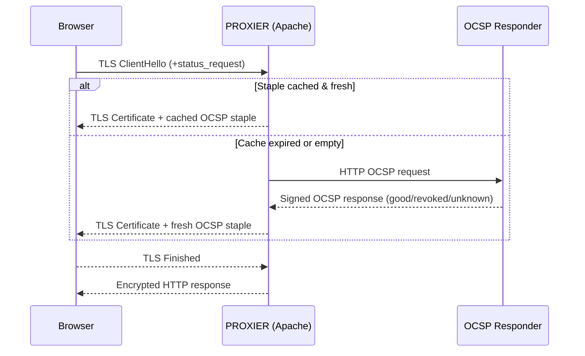

# OCSP Stapling Demo

A real-world, end-to-end example that shows how **Online Certificate Status Protocol (OCSP) stapling** can be enabled in a modern micro-service stack.

> TL;DR: Run `docker compose up --build`, open https://localhost and inspect the TLS handshake – you will see the pre-fetched OCSP response (the *staple*) delivered by the proxy instead of an extra round-trip to the CA.

---

## Table of Contents
1. What is OCSP?
2. What is OCSP Stapling and why use it?
3. How OCSP Stapling works in this project
4. Architecture & Containers
5. Quick Start (Full Walk-Through)
6. Verifying that Stapling Works
7. File Structure Cheat-Sheet
8. OCSP & Stapling – Super-Short Primer
9. Tear-Down
10. Troubleshooting FAQ
11. References
12. TLS & OCSP Stapling – Sequence Diagram
13. Playing with Certificate Status (Good → Revoked → Unknown)

---

## 1. What is OCSP?
**OCSP** is an Internet PKI standard (RFC 6960) that allows clients to check whether an X.509 certificate has been revoked **online**. Instead of downloading a full Certificate Revocation List (CRL), the client sends a small HTTP request that contains the certificate serial number to an **OCSP Responder** operated by the Certificate Authority (CA). The responder answers with the certificate status: *good*, *revoked* or *unknown*.

Pros:
* Near real-time revocation information
* Lightweight compared to CRLs

Cons:
* Extra network round-trip on every handshake
* Adds latency to HTTPS connections
* Creates a privacy leak – the CA learns which sites a user visits

---

## 2. What is OCSP Stapling & why use it?
**OCSP Stapling** (RFC 6066, TLS extension `status_request`) moves the responsibility for querying the CA from the **client** to the **server**:

1. The server periodically fetches (and caches) its own OCSP response from the CA.
2. During the TLS handshake the server *staples* (attaches) this signed response to the `Certificate` message.
3. The client validates the staple using the CA's signature – no need to contact the OCSP Responder directly.

Benefits:
* 🏎  **Performance** – eliminates an extra round-trip, reducing TLS handshake latency by ~100-300 ms.
* 🔒  **Privacy** – the CA no longer sees which clients visit the site.
* 🌩  **Resilience** – clients can still validate your certificate even if the CA's OCSP endpoint is unreachable.

---

## 3. How OCSP Stapling works in this project
This repository provisions a tiny PKI, starts an **Apache HTTP Server** configured for OCSP stapling in front of a **FastAPI** application and serves a minimal JavaScript UI. An **OCSP Responder** container (based on an existing image) answers status requests for the demo CA.

The Apache proxy (TLS terminator) automatically retrieves the OCSP response with `mod_ssl` and caches it. When your browser connects, you can see the stapled response in DevTools or via `openssl s_client`.

---

## 4. Architecture & Containers

```
+-------------+       HTTPS (TLS+Staple)      +-----------+
|   Browser   |  <---------------------------- |  PROXIER  |
+-------------+                               +-----------+
                                                       |
                                                       |  HTTP
                                                       v
                                              +----------------+
                                              |     API        |
                                              | (FastAPI)      |
                                              +----------------+

+-----------------+            +-------------------+
|    CA & PKI     |  ----->    |  OCSP_Responder   |
|   (OpenSSL)     |  CRL/DB    | (RFC 6960 server) |
+-----------------+            +-------------------+
```

Container overview:

| Name | Base Image | Purpose |
|------|------------|---------|
| **UI** | (served by Apache `htdocs/`) | Static HTML/JS frontend – no dedicated container needed. |
| **API** | `python:3.12-slim` | FastAPI backend (echo service). |
| **PROXIER** | `httpd:2.4-alpine` | TLS termination, reverse proxy to API, OCSP stapling enabled. |
| **OCSP_Responder** | `alpine:3` + `openssl` | Answers OCSP requests for the demo CA. |

---

## 🛠️  5. Quick Start (Full Walk-Through)

Follow this exact order – it takes less than a minute on a modern machine:

```bash
# 1) Clone & enter the project
$ git clone https://github.com/your-org/ocsp-stapling-demo.git
$ cd ocsp-stapling-demo

# 2) Generate the demo certificates **before** building the images
$ ./pki/gen.sh

# 3) Build & start the stack (API ➜ OCSP ➜ Apache proxy)
$ docker compose up --build
```

Open https://localhost in your browser (accept the self-signed certificate warning).  You should see the demo page instantly because **Apache has already stapled a fresh OCSP response** – no extra round-trip was required.

### ⏱️  What just happened?
1. `gen.sh` created a tiny Public-Key-Infrastructure (PKI):
   * a *Root CA* (self-signed)
   * a *server certificate* for `localhost`
   * an *OCSP Responder* certificate (with the special *OCSP Signing* EKU)
   * an OpenSSL *index.txt* database that tracks the status of all issued certs
2. Docker Compose started **three** containers:
   1. **api** – a FastAPI service listening on port 8000 (HTTP)
   2. **ocsp_responder** – a super-simple OpenSSL process answering OCSP queries on port 8080 (HTTP)
   3. **proxier** – Apache HTTP Server (mod_ssl) acting as a TLS terminator on port 443 (HTTPS)
3. On first start Apache fetched its own OCSP status from the responder and cached it in shared memory.  Every subsequent TLS handshake re-uses this cached staple (until it nears expiry, then it is refreshed automatically).

---

## 🔬 6. Verifying that Stapling Works

### a) OpenSSL CLI

```bash
$ openssl s_client -connect localhost:443 -servername localhost -status 2>/dev/null | \
  sed -n '/OCSP Response Data/,+15p'
```
Look for these lines:

```
OCSP Response Status: successful (0x0)
    Cert Status: good
```
That proves your browser did **not** have to contact the CA – everything was delivered by the server.

### b) Browser DevTools
1. Press <kbd>F12</kbd> → *Network* tab.
2. Reload the page and click the top request (document).
3. Open the *Security* (🛡️) panel – you should see *OCSP Response → Good*.

### c) Packet Capture (optional)
If you run Wireshark on `lo` / `docker0`, you will **not** find any outgoing traffic to the OCSP endpoint while loading the page – stapling removed that round-trip completely.

---

## 🧩 7. File Structure Cheat-Sheet

```
├── api/                # FastAPI backend
│   ├── main.py
│   ├── Dockerfile
│   └── requirements.txt
├── proxier/            # Apache TLS terminator (with OCSP stapling)
│   ├── httpd.conf
│   ├── Dockerfile
│   └── htdocs/index.html
├── ocsp_responder/     # Tiny OpenSSL OCSP server
│   ├── run.sh
│   └── Dockerfile
├── pki/                # Mini-CA that issues two leaf certs
│   ├── gen.sh          # ← run me!
│   └── output/         # All generated keys & certs (mounted into containers)
└── docker-compose.yml  # Glue everything together
```

---

## 🧑‍🎓 8. OCSP & Stapling – Super-Short Primer

• **OCSP** – a real-time protocol that asks *"Is certificate X revoked?"*  The question is sent to the CA every time your browser opens a new TLS connection.  This adds latency and leaks browsing history to the CA.

• **Stapling** – the server does that check *once* on behalf of every client, signs the answer (*staple*) with the CA's key and attaches it to the TLS handshake.  Clients only need to verify the signature – zero extra network RTTs.


---

## 🧹 9. Tear-Down

```bash
$ docker compose down -v   # stop & remove containers + anonymous volumes
$ rm -rf pki/output        # wipe the demo PKI if you like
```

---

## 🗒️ 10. Troubleshooting FAQ

1. **Browser says *"OCSP response invalid or expired"*** – run `./pki/gen.sh` again and `docker compose restart proxier`.
2. **Port 443 already in use** – change the mapping in `docker-compose.yml`.
3. **Wanted to use a real domain** – regenerate the server certificate with `CN=your.domain` and update DNS → works the same.

---

## 11. References
* RFC 6960 – Online Certificate Status Protocol
* RFC 6066 – TLS Extensions (section 7 – OCSP stapling)
* [Mozilla SSL Configuration Generator](https://ssl-config.mozilla.org/)
* [FastAPI](https://fastapi.tiangolo.com/)
* [Apache HTTP Server – OCSP Stapling How-To](https://httpd.apache.org/docs/2.4/howto/ssl.html#ocspstapling)

---

Feel free to open issues or pull requests – happy stapling! :tada:

## 📊 12. TLS & OCSP Stapling – Sequence Diagram



---

## 🧪 13. Playing with Certificate Status (Good → Revoked → Unknown)

One advantage of running your **own** CA & OCSP responder is that you can flip certificate states at will.  The table below shows how to simulate each state and what you should see in the client.

| Desired state | Steps (run from project root) | Expected `openssl s_client -status` lines |
|---------------|-------------------------------|-------------------------------------------|
| **good** (default) | 1. `docker compose up -d` | `Cert Status: good` |
| **revoked** | 1. `docker compose stop proxier`  <br>2. `openssl ca -config pki/output/openssl.cnf -revoke pki/output/certs/server.crt`  <br>3. `docker compose restart ocsp_responder proxier` | `Cert Status: revoked`  <br>`Revocation Time:` (the timestamp you just created) |
| **unknown** | 1. `docker compose stop proxier`  <br>2. `sed -i '/server.crt/d' pki/output/index.txt`  (removes the record)  <br>3. `docker compose restart ocsp_responder proxier` | `Cert Status: unknown` |

After each change rerun:

```bash
$ openssl s_client -connect localhost:443 -servername localhost -status 2>/dev/null | \
  sed -n '/OCSP Response Data/,+15p'
```

Tip: Watch the Apache logs (`docker compose logs -f proxier`) – you should see it automatically fetching a *fresh* OCSP response whenever you changed the database.

---
